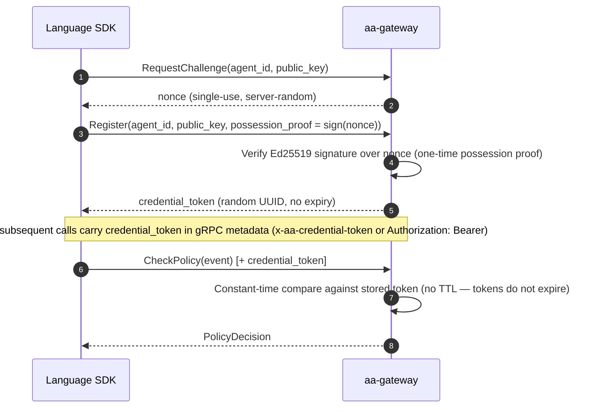

# Security model

AI Agent Assembly is a **governance layer for AI agents** — it enforces policy, tracks cost, and intercepts unsafe actions before they run. This page documents the security posture behind that enforcement, for enterprise security and compliance teams. It covers the layered defense model, a STRIDE threat analysis, the cryptography in use, and the audit and compliance posture.

---

## IronClaw five-layer defense

AI Agent Assembly groups its security controls into five named layers. Each layer is independently deployable and adds defense-in-depth — if one layer is bypassed, the next still applies.

| Layer | Name | What it does |
|---|---|---|
| 1 | **Boundary** | Network perimeter: the sidecar proxy (`aa-proxy`) can enforce an egress allowlist on the traffic it intercepts, but **that allowlist is empty by default — default-open**, so out of the box the only host-level control that always applies is the SSRF guard, which refuses CONNECT targets resolving to loopback, private, link-local or cloud-metadata addresses and **cannot be relaxed in a production binary**. eBPF sensor (`aa-ebpf`, **Linux 5.8+ with BTF**) is mostly **observation**: uprobes attach `SSL_read`/`SSL_write` on the first mapping whose path contains `libssl.so`, so they miss OpenSSL 3.x `_ex` callers and are blind to any stack that neither exports those symbols nor loads as a `libssl.so` mapping — Go, `rustls`, GnuTLS, NSS, and statically-linked BoringSSL as in Node. One probe *can* enforce — a syscall allowlist that `SIGKILL`s a monitored process — but it is **opt-in and disabled by default**, planned only when a confine-target PID is explicitly configured **and** the policy lowers to a non-empty allowlist; and even then the signal lands *after* the offending syscall has executed. Observing a syscall is not preventing it |
| 2 | **Identity** | Agent and user authentication: the gRPC agent plane is authenticated by a random per-agent credential token (UUID, constant-time compare, no expiry) minted after a one-time Ed25519 possession-proof at registration. Operator SSO (SAML 2.0 / OIDC) is **not implemented** — see [Authentication flow](#authentication-flow). A separate HMAC-SHA256 JWT (24h TTL) protects the REST/admin surface only, and that surface's auth is **off by default** — see the callout in [Authentication flow](#authentication-flow) below |
| 3 | **Policy** | Runtime governance: YAML/JSON policy rules evaluated by the gateway policy engine — **for the calls that reach it**, which is not every agent action. SDK-instrumented calls and the proxy's non-LLM MitM path consult the gateway. The proxy's LLM path does **not**: it applies a local in-tunnel egress allowlist and returns 403 itself, without a gateway round-trip — and **that allowlist is empty by default**, so unless an operator configures one it denies nothing on that basis and only the always-on SSRF guard applies. Under the `llm_only` default, hosts the proxy does not intercept are transparently tunnelled and evaluated by nothing |
| 4 | **Vault** | 🗺️ **Largely aspirational.** An in-memory `SecretsStore` is mounted, but it is empty in every shipped build with no route or command able to populate it, there is no encryption at rest or key management, and successful resolution hands the plaintext back to the caller — see [Secrets management](#secrets-management). Ed25519 is used for the one-time agent registration proof, not for a vault |
| 5 | **Telemetry** | Audit and observability: per-session JSONL event log with an unkeyed SHA-256 hash chain (verify with `aasm audit verify-chain`), append-only by convention and best-effort on emission — see [Audit log](#audit-log) for the exact bounds; Slack/webhook connectors for alerting on policy violations |

> **How the five layers relate to the three interception points.** The five *defense-in-depth layers* above (Boundary, Identity, Policy, Vault, Telemetry) describe *what* is protected. The three *interception points* named on the landing page and marketing site — the SDK layer, the sidecar proxy (`aa-proxy`), and the eBPF sensor (`aa-ebpf`) — describe *where* enforcement is applied, and all three sit inside the **Boundary** layer. They are two views of one system, not two competing models.

---

## STRIDE threat model

The table below maps each STRIDE category to the five primary components of AI Agent Assembly and the control that mitigates it.

| Component | **S**poofing | **T**ampering | **R**epudiation | **I**nfo Disclosure | **D**enial of Service | **E**levation of Privilege |
|---|---|---|---|---|---|---|
| **Language SDK** | One-time Ed25519 possession-proof at registration, then a random per-agent credential token (constant-time compare) on every call | SDK integrity verified by Cargo/npm/PyPI package hash | Calls are logged with agent ID and timestamp on a best-effort path — entries are dropped under backpressure, so absence is not proof of absence ([Audit log](#audit-log)) | gRPC transport is plaintext by default — the app-layer credential-token interceptor authenticates every call; mTLS is an optional, unwired hardening layer; a redaction scanner runs over logged fields and audit payloads to strip credential-shaped values — a mitigation with finite detection coverage, not a guarantee that a secret can never be logged | Rate limiting enforced by gateway budget tracker | Policy engine enforces agent scope; no ambient privilege |
| **Gateway (aa-gateway)** | Credential-token interceptor is fail-closed on audit, approval, topology, secrets and invalidation — but **`PolicyService` and `AgentLifecycleService` are enrichment-only and never reject**, so those two accept unauthenticated calls (see Info Disclosure). REST/admin surface can opt into JWT validation, off by default | Per-service decoded-message-size caps; policy documents are schema-validated and reject unknown keys fail-closed. This is not blanket input validation on every RPC | JSONL audit log with an unkeyed SHA-256 hash chain (`aasm audit verify-chain`); the DB mirror carries no chain metadata, emission is best-effort, and budget debits are not separately audited — repudiation cover is partial, see [Audit log](#audit-log) | ⚠️ **The endpoint defends itself with nothing — reachability is the control, and that is yours to enforce.** It binds `127.0.0.1:50051` by default, but `--listen` will bind it anywhere, the transport is plaintext (mTLS is unwired), and **`PolicyService` and `AgentLifecycleService` are mounted with an *enrichment* interceptor that returns `Ok` unconditionally**: it attaches a caller identity if a valid token is present and proceeds anyway if not. Only audit, approval, topology, secrets and invalidation get the fail-closed interceptor. Anyone who can reach the port can call policy evaluation and agent registration **unauthenticated**. "Internal-only" is an operator responsibility, not a property this software enforces | Per-team budget caps block runaway agent spending | RBAC on administrative endpoints **only when auth is enabled** — the gateway's REST/admin surface is bypass-by-default, and under `AuthMode::Off` every guarded route resolves to a synthetic admin caller, so no role check applies |
| **Sidecar Proxy (aa-proxy)** | The proxy mints a per-host certificate from its own CA, which the agent must trust — so a third party cannot impersonate the proxy to an agent that has the CA installed. It does not stop an agent choosing not to route through the proxy at all | On connections the proxy itself dials — i.e. hosts it intercepts — upstream certificates are validated against the OS root store. Two bounds: `skip_upstream_tls_verify` replaces that with an accept-any verifier (integration tests only), and hosts transparently tunnelled under the `llm_only` default are never terminated by the proxy, so it validates nothing on them | 🗺️ **No proxy audit file is produced by any shipped build.** A `ProxyAuditEntry` JSONL stream exists in the code, but `ProxyServer::new` hardcodes the sink to `None`, the emit path early-returns, and `ProxyConfig` has no audit-path setting — so no operator configuration turns it on; reaching it requires embedding `aa-proxy` as a library. Were it enabled it would be a separate stream from the gateway's, **not** hash-chained, losing a line on write failure. Do not plan an audit trail around it | Proxy does not log request/response bodies by default | ⚠️ **Nothing bounds connection concurrency.** There is no connection pool, no semaphore, no concurrency limit and no circuit breaker anywhere in `aa-proxy`; the accept loop spawns an unbounded task per connection. The only bounded resource is the TLS certificate LRU cache | On Linux the process sets `PR_SET_DUMPABLE=0` (best-effort, non-fatal) so same-uid processes cannot ptrace it or read a core dump. Running as an unprivileged user and restricting filesystem writes are **deployment** responsibilities — the software does not enforce either |
| **eBPF Sensor (aa-ebpf)** | eBPF program loaded only by privileged system service | BPF verifier rejects unsafe programs at load time | Kernel event timestamps come from a monotonic clock, so they cannot be reordered by adjusting wall-clock time; this says nothing about altering a record after it is written | ⚠️ **Reads considerably more than TLS buffers, including full file paths.** Alongside the `SSL_read`/`SSL_write` uprobes: fourteen file-I/O kprobe/kretprobe targets (`openat`, `read`, `write`, `unlinkat`, `renameat2` and their legacy entry points) carry a 256-byte `path` field, so **file paths are captured**; exec tracepoints capture pid, ppid, uid and filename (PID-filtered — an empty filter map emits nothing); fork/clone is traced for descendant tracking; process-exit events are emitted; and a syscall tracepoint sees syscall numbers. TLS, file-I/O and exec probes all load by default. Unlike exec and the syscall guard, the file-I/O kprobes have no fork propagation. Treat this as the collection scope for a privacy assessment | eBPF programs have bounded execution; verifier enforces loop limits | Loaded via CAP_BPF only; capability is dropped after program load |
| **REST API (aa-api)** | API-key or JWT validation on every request; `aa-api` defaults auth **on**, the local in-memory development mode bypasses it. No SSO | OpenAPI schema validation rejects malformed inputs | Mutating API calls are logged with actor identity on the same best-effort path; under `AuthMode::Off` the recorded actor is the synthetic admin caller, not a real identity | 🗺️ **HTTPS and HSTS are not provided by this software.** It serves HTTP; terminating TLS and setting HSTS is your deployment's job. Query strings are not logged at all: the request-tracing span records method, path and request id, and `.path()` excludes the query. (Credential redaction over request targets is the *proxy's*, not this component's, and is a no-op when its scanner is disabled) | Per-key rate limiting is enforced in `aa-auth`. 🗺️ **There is no DDoS mitigation and no load balancer** — the previous claim described infrastructure that is not deployed | 🗺️ **Not enforced at the API layer.** The router gate verifies an API key or JWT; per-handler scope and tenant checks are explicitly the handler's responsibility, so this is not a systematic cross-tenant control |

> **Traceability**: Each STRIDE row maps to a specific IronClaw layer control. For configuration paths and runbook references, consult the security runbook in the `agent-assembly` repository.

---

## Cryptographic primitives

| Primitive | Algorithm | Key length | Usage | Rotation cadence (NIST SP 800-57) |
|---|---|---|---|---|
| Agent registration proof | Ed25519 | 256-bit | One-time possession-proof signature over a server-issued nonce, verified at `RegisterAgent`; not a reusable bearer credential | Agent-supplied keypair; not gateway-managed |
| Agent credential token | UUID v4 (CSPRNG) | 122-bit random | Bearer credential presented on every agent-plane gRPC call after registration; validated with a constant-time compare | No expiry — replaced only on re-registration |
| REST/admin session token | JWT (HMAC-SHA256) | 256-bit | Authenticates REST/admin API callers; only issued when gateway auth is explicitly enabled (off by default) | 24h token TTL |
| ~~Vault encryption~~ | — | — | **Removed.** No AES-256-GCM implementation exists in the workspace crates — see [Secrets management](#secrets-management) | — |
| Webhook signature verification (**inbound**) | HMAC-SHA256 | 256-bit | Verifies the signature on audit webhooks **received from** SaaS coding-agent providers (Claude.ai, ChatGPT, Cursor), checked before the body is parsed. There is no outbound webhook signing path — this direction is verification only | Shared secret is issued and rotated by the sending provider, not by this software |
| TLS (transport) | TLS 1.3 | ECDHE-256 | Operator/external HTTPS traffic; the gRPC agent-plane transport is plaintext by default (see the callout below) | Certificate: every 90 days (auto-renewed) |

Keys listed above are generated using a CSPRNG. MD5, SHA-1 and DES are not used by any primitive in this table — a statement about first-party code in the `agent-assembly` workspace, not about the full transitive dependency tree, which this hub does not audit.

---

## Authentication flow

> ⚠️ **Gateway auth is off by default.** A bare `aa-gateway` boots with
> `AuthMode::Off` on its REST/admin surface — the zero-config `aasm status`
> path (and any other REST/admin route) is served with no credential until an
> operator explicitly opts in with `AA_GATEWAY_AUTH=on` and a valid
> `AA_JWT_SECRET`. This is unrelated to the gRPC agent-plane's
> credential-token interceptor below, which is always on. `aa-api` (the
> dashboard API) defaults auth **on**; the gateway is the off-by-default
> surface. See [Open core boundary](open-core-boundary.md) for how this
> pairs with the self-host posture.

### SDK to gateway (gRPC)



### Operator authentication

Operators authenticate to the REST/admin surface with an **API key or a JWT** —
the same two mechanisms listed in [Cryptographic primitives](#cryptographic-primitives)
above. There is no third path.

> 🗺️ **Operator SSO is planned and not implemented.** This page previously carried
> a SAML/OIDC sign-in sequence against a hosted console. Neither exists: there is no
> SSO implementation anywhere in `aa-api`, `aa-gateway`, or `aa-auth`, and no console
> to sign in to. Treat identity federation as a design intent — see
> [Open core boundary](open-core-boundary.md) — not as an available control, and do
> not plan an IdP integration against it.

---

## Secrets management

> 🗺️ **The managed secret vault this section previously described does not
> exist.** It claimed AES-256-GCM encryption at rest under a master key in a SaaS
> control-plane HSM, with rotation from a console. There is no AES-256-GCM
> implementation in the workspace crates, no HSM or KMS integration, and no
> console.

**Do not treat this stack as a secret store.** That advice is unchanged, but the
precise state is narrower than "nothing ships" — and less reassuring:

- **A store type exists and is mounted.** There is a `SecretsStore` trait with one
  implementation, `InMemorySecretsStore`, wired into both the API and the gateway.
- **It is always empty in a shipped build.** Both production constructions
  instantiate it empty, and nothing can populate it: there is no registration
  route in the OpenAPI surface and no `aasm secrets` command. Every `${NAME}`
  placeholder therefore resolves to `UnknownPlaceholder` and the request fails
  (HTTP 422 / gRPC `FailedPrecondition`).
- **Where resolution does succeed, the caller receives the plaintext.** The
  resolver substitutes `${NAME}` tokens and returns the post-substitution
  arguments to the caller, rather than the gateway making the outbound call
  itself. The agent process ends up holding the raw credential. The audit entry
  records placeholder *names* only, so the credential is not written to the audit
  stream — but the agent has it.
- **Nothing encrypts it.** In-memory only, no encryption at rest, no key
  management.

So if you self-host, secrets reaching the gateway, proxy, or SDK are handled by
whatever you supply them through — environment, file, or your own secret manager —
and their protection is your deployment's responsibility, not this software's.
Whether this surface is completed or removed is an open decision; this page
describes only its current state.

---

## Audit log

Policy decisions and agent-reported events are appended to a **per-session JSON
Lines audit file**, one line per entry. Database tables (`audit_events`,
`audit_logs`) hold a **mirror** of those records for querying. The properties below
are stated precisely, because "immutable audit log" is a claim a security reviewer
should be able to check rather than take on trust. All of it is verifiable against
the Apache-2.0
[`agent-assembly`](https://github.com/ai-agent-assembly/agent-assembly) source.

**The JSONL file is hash-chained, and you can verify it yourself.** Each entry
carries a SHA-256 digest over its own fields plus the preceding entry's digest
(`aa-core/src/audit.rs`). An operator can check a file end to end with:

```bash
aasm audit verify-chain <path-to-session>.jsonl
```

which reports the number of entries verified, or fails naming the first bad index.

**The chain is unkeyed, so bound what it proves.** There is no log-signing key, no
HMAC, no signature, and no external anchoring over audit records anywhere in the
codebase. The chain detects casual or partial modification; it does **not** resist
an actor who can rewrite the file, because that actor can recompute a fully valid
chain. It also proves only that the entries present are internally consistent — not
that every action produced one.

**The database mirror carries no chain metadata.** The runtime-to-storage
conversion deliberately drops `seq`, `previous_hash`, and `entry_hash`, and neither
`audit_events` nor `audit_logs` has a column for them. **There is no verification
routine that can run against either table** — chain verification applies to the
JSONL files only.

**The log is append-only by convention, not by constraint.** Retention pruning
issues `DELETE FROM audit_events` against rows older than the cutoff in both the
SQLite and Postgres drivers; a backfill migration has issued `UPDATE` against
`audit_logs`; and the offline spill buffer evicts its oldest events when it hits
its cap. There is no database trigger, revoked grant, or WORM setting preventing
deletion or update, and the JSONL file is appended without `fsync`.

**Emission is best-effort and decoupled from enforcement.** Entries are handed to a
bounded in-process channel with a non-blocking send; on backpressure the entry is
dropped, counted in an `audit_drops` metric, and the action proceeds anyway. A
crash before flush loses whatever is still buffered. **Budget debits emit no
dedicated audit entry at all** — the budget event types exist in the schema but are
never constructed, so a debit is visible only via the surrounding decision entry,
which is itself droppable. Absence of an entry is therefore not proof that an
action did not occur.

**A dropped entry looks like tampering.** The chain head advances even when an
entry is dropped, so `verify-chain` reports a failure for a gap caused by
backpressure exactly as it would for a malicious edit. Treat a verification failure
as "investigate", not as "compromise".

**Retention is an operator-set policy, not a per-tenant setting.** The storage
drivers apply a retention policy that prunes rows past a configured age. This hub
does not publish a default retention period or a per-plan retention figure — there
is no managed service to enforce one.

**Export is via the CLI, in three formats.** `aasm audit export --format
<csv|json|jsonl>` writes CSV, a JSON array, or JSON Lines; `--format` is required
and has no default. A second command, `aasm audit compliance-export`, emits
compliance-shaped records and can prepend a framework metadata header. JSONL is the
format to prefer for a SIEM or a cold-storage archive, because each line parses
independently and the stream appends without re-rendering.

There is **no CEF output** and no direct SIEM integration — feeding a SIEM means
ingesting an exported file. See the
[core CLI docs](https://docs.agent-assembly.com/core/) for the full command surface.

---

## Compliance posture

**AI Agent Assembly holds no compliance certification, and no compliance
assessment has been completed.** No SOC 2, ISO 27001, or equivalent audit has been
performed against the product or against a managed service. No Data Processing
Agreement or Business Associate Agreement is available.

This section previously published a certification status table with a target date.
There was no audit report, assessment scope, or executed legal template behind any
row of it, so the table was removed rather than relabelled — a status table in a
compliance section reads to a procurement reviewer as a programme with a
trajectory, which is itself the claim.

What this page *can* tell a security reviewer is what the system does: the layered
defense model, the STRIDE analysis, the cryptographic primitives actually in use,
and the audit log's real integrity properties — all documented above, and all
verifiable against the Apache-2.0 source.

The [SaaS claim publication checklist](saas-claim-publication-checklist.md) records
what has to exist before any certification or legal-instrument claim is published
here, and who must approve it.

---

## Related documentation

- [Why AI Agent Assembly?](comparison.md) — competitive positioning and governance differentiation
- [Cloud deployment](cloud-deployment.md) — the managed control plane, which is planned and not available
- [Open core boundary](open-core-boundary.md) — what is in the Apache-2.0 core today vs. intended for the commercial tier
- [Source of truth & status](source-of-truth.md) — the canonical maturity label for every area of this hub
- [SaaS claim publication checklist](saas-claim-publication-checklist.md) — what must be evidenced before managed-service or compliance claims are published

<div class="aa-cta-next">
  <span class="aa-cta-next__label">Evaluating for production?</span>
  <a href="https://agent-assembly.com/early-access?utm_source=docs&amp;utm_medium=docs_link&amp;utm_campaign=early_access&amp;utm_content=security_model_page" data-cta-location="body" rel="noopener">Request Cloud Early Access →</a>
  <p>Talk to the team about the STRIDE model and the audit log's integrity
     properties. Registering interest is not a purchase or a commitment by either
     side, and no compliance certification, DPA or BAA is available today.</p>
</div>

---

*Last reviewed: 2026-08-06 — AI Agent Assembly Team*
