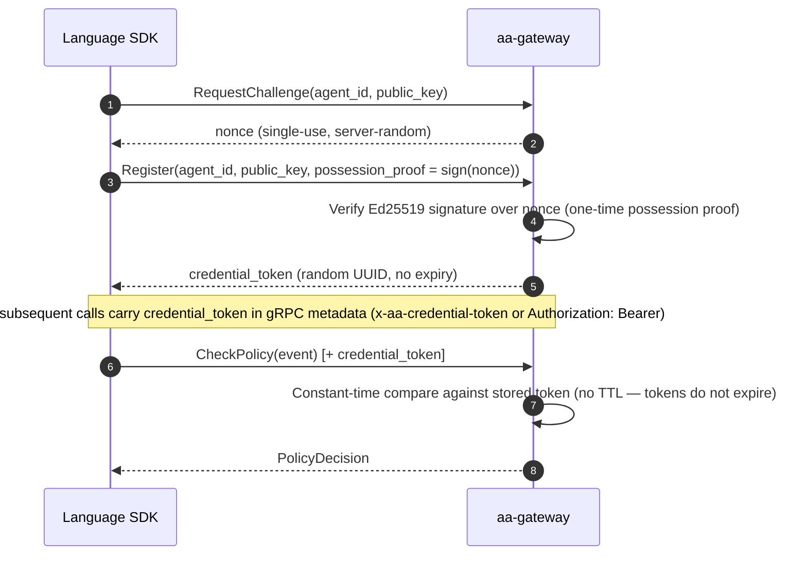
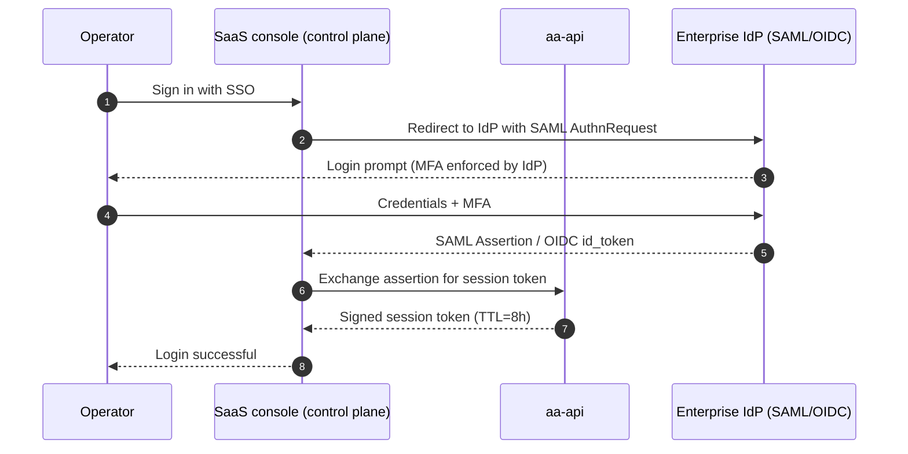

# Security model

AI Agent Assembly is a **governance layer for AI agents** — it enforces policy, tracks cost, and intercepts unsafe actions before they run. This page documents the security posture behind that enforcement, for enterprise security and compliance teams. It covers the layered defense model, a STRIDE threat analysis, the cryptography in use, and the audit and compliance posture.

---

## IronClaw five-layer defense

AI Agent Assembly groups its security controls into five named layers. Each layer is independently deployable and adds defense-in-depth — if one layer is bypassed, the next still applies.

| Layer | Name | What it does |
|---|---|---|
| 1 | **Boundary** | Network perimeter: sidecar proxy (`aa-proxy`) enforces egress policy; eBPF sensor (`aa-ebpf`) catches kernel-level bypass attempts |
| 2 | **Identity** | Agent and user authentication: the gRPC agent plane is authenticated by a random per-agent credential token (UUID, constant-time compare, no expiry) minted after a one-time Ed25519 possession-proof at registration; operator authentication via SAML 2.0 / OIDC SSO. A separate HMAC-SHA256 JWT (24h TTL) protects the REST/admin surface only, and that surface's auth is **off by default** — see the callout in [Authentication flow](#authentication-flow) below |
| 3 | **Policy** | Runtime governance: YAML/JSON policy rules evaluated by the gateway policy engine before every agent action |
| 4 | **Vault** | Secret and credential management: AES-256-GCM encryption at rest for stored secrets; Ed25519-signed tokens for inter-component trust |
| 5 | **Telemetry** | Audit and observability: per-session JSONL event log with an unkeyed SHA-256 hash chain (verify with `aasm audit verify-chain`), append-only by convention and best-effort on emission — see [Audit log](#audit-log) for the exact bounds; Slack/webhook connectors for alerting on policy violations |

> **How the five layers relate to the three interception points.** The five *defense-in-depth layers* above (Boundary, Identity, Policy, Vault, Telemetry) describe *what* is protected. The three *interception points* named on the landing page and marketing site — the SDK layer, the sidecar proxy (`aa-proxy`), and the eBPF sensor (`aa-ebpf`) — describe *where* enforcement is applied, and all three sit inside the **Boundary** layer. They are two views of one system, not two competing models.

---

## STRIDE threat model

The table below maps each STRIDE category to the five primary components of AI Agent Assembly and the control that mitigates it.

| Component | **S**poofing | **T**ampering | **R**epudiation | **I**nfo Disclosure | **D**enial of Service | **E**levation of Privilege |
|---|---|---|---|---|---|---|
| **Language SDK** | One-time Ed25519 possession-proof at registration, then a random per-agent credential token (constant-time compare) on every call | SDK integrity verified by Cargo/npm/PyPI package hash | Every call logged with agent ID and timestamp | gRPC transport is plaintext by default — the app-layer credential-token interceptor authenticates every call; mTLS is an optional, unwired hardening layer; secrets never logged | Rate limiting enforced by gateway budget tracker | Policy engine enforces agent scope; no ambient privilege |
| **Gateway (aa-gateway)** | Credential-token interceptor validates every agent-plane gRPC call (fail-closed on approval/audit/topology/secrets); REST/admin surface can opt into JWT validation, off by default | Input validation on all RPCs; schema-enforced policy rules | JSONL audit log with an unkeyed SHA-256 hash chain (`aasm audit verify-chain`); the DB mirror carries no chain metadata, emission is best-effort, and budget debits are not separately audited — repudiation cover is partial, see [Audit log](#audit-log) | Internal-only gRPC endpoint; never exposed directly | Per-team budget caps block runaway agent spending | RBAC on all administrative API endpoints |
| **Sidecar Proxy (aa-proxy)** | Per-host CA pinning prevents MitM spoofing by agents | TLS termination with certificate validation on every upstream | All intercepted requests logged by proxy before forwarding | Proxy does not log request/response bodies by default | Connection pool limits per agent; circuit breaker on upstream failure | Proxy runs as unprivileged user; no write access to host filesystem |
| **eBPF Sensor (aa-ebpf)** | eBPF program loaded only by privileged system service | BPF verifier rejects unsafe programs at load time | Kernel event timestamps are monotonic; cannot be retroactively altered | eBPF only reads SSL buffers; no access to unrelated memory regions | eBPF programs have bounded execution; verifier enforces loop limits | Loaded via CAP_BPF only; capability is dropped after program load |
| **REST API (aa-api)** | SAML/OIDC token validation on every request | OpenAPI schema validation rejects malformed inputs | All mutating API calls logged with actor identity | HTTPS-only; HSTS enforced; no sensitive data in query strings | Rate limiting per IP and per tenant; DDoS mitigation via upstream load balancer | Tenant isolation enforced at API layer; cross-tenant access rejected |

> **Traceability**: Each STRIDE row maps to a specific IronClaw layer control. For configuration paths and runbook references, consult the security runbook in the `agent-assembly` repository.

---

## Cryptographic primitives

| Primitive | Algorithm | Key length | Usage | Rotation cadence (NIST SP 800-57) |
|---|---|---|---|---|
| Agent registration proof | Ed25519 | 256-bit | One-time possession-proof signature over a server-issued nonce, verified at `RegisterAgent`; not a reusable bearer credential | Agent-supplied keypair; not gateway-managed |
| Agent credential token | UUID v4 (CSPRNG) | 122-bit random | Bearer credential presented on every agent-plane gRPC call after registration; validated with a constant-time compare | No expiry — replaced only on re-registration |
| REST/admin session token | JWT (HMAC-SHA256) | 256-bit | Authenticates REST/admin API callers; only issued when gateway auth is explicitly enabled (off by default) | 24h token TTL |
| Vault encryption | AES-256-GCM | 256-bit | Encrypts secrets and credentials at rest | Every 1 year or on compromise |
| Callback / webhook signature | HMAC-SHA256 | 256-bit | Signs outbound webhook payloads so receivers can verify authenticity | Every 90 days or on rotation of webhook secret |
| TLS (transport) | TLS 1.3 | ECDHE-256 | Operator/external HTTPS traffic; the gRPC agent-plane transport is plaintext by default (see the callout below) | Certificate: every 90 days (auto-renewed) |

All keys are generated using a CSPRNG. No MD5, SHA-1, or DES primitives are used anywhere in the stack.

---

## Authentication flow

> ⚠️ **Gateway auth is off by default.** A bare `aa-gateway` boots with
> `AuthMode::Off` on its REST/admin surface — the zero-config `aasm status`
> path (and any other REST/admin route) is served with no credential until an
> operator explicitly opts in with `AA_GATEWAY_AUTH=on` and a valid
> `AA_JWT_SECRET`. This is unrelated to the gRPC agent-plane's
> credential-token interceptor below, which is always on. `aa-api` (the
> dashboard API) defaults auth **on**; the gateway is the off-by-default
> surface. See [Open core boundary](open-core-boundary.md) for how this
> pairs with the self-host posture.

### SDK to gateway (gRPC)



### Operator to console (SAML/OIDC)

Operators sign in through the SaaS console (control plane) — SSO is a hosted
control-plane flow, not an `aasm` CLI command.



---

## Secrets management

- Secrets (LLM API keys, webhook tokens) are stored encrypted with AES-256-GCM.
- The encryption key is derived from a master secret held in the SaaS control plane's hardware security module (HSM).
- Secrets are never written to disk in plaintext.
- Secrets are never logged, even at `DEBUG` level.
- Secret rotation is performed from the SaaS console (control plane), which re-encrypts in place without a service restart.

---

## Audit log

Policy decisions and agent-reported events are appended to a **per-session JSON
Lines audit file**, one line per entry. Database tables (`audit_events`,
`audit_logs`) hold a **mirror** of those records for querying. The properties below
are stated precisely, because "immutable audit log" is a claim a security reviewer
should be able to check rather than take on trust. All of it is verifiable against
the Apache-2.0
[`agent-assembly`](https://github.com/ai-agent-assembly/agent-assembly) source.

**The JSONL file is hash-chained, and you can verify it yourself.** Each entry
carries a SHA-256 digest over its own fields plus the preceding entry's digest
(`aa-core/src/audit.rs`). An operator can check a file end to end with:

```bash
aasm audit verify-chain <path-to-session>.jsonl
```

which reports the number of entries verified, or fails naming the first bad index.

**The chain is unkeyed, so bound what it proves.** There is no log-signing key, no
HMAC, no signature, and no external anchoring over audit records anywhere in the
codebase. The chain detects casual or partial modification; it does **not** resist
an actor who can rewrite the file, because that actor can recompute a fully valid
chain. It also proves only that the entries present are internally consistent — not
that every action produced one.

**The database mirror carries no chain metadata.** The runtime-to-storage
conversion deliberately drops `seq`, `previous_hash`, and `entry_hash`, and neither
`audit_events` nor `audit_logs` has a column for them. **There is no verification
routine that can run against either table** — chain verification applies to the
JSONL files only.

**The log is append-only by convention, not by constraint.** Retention pruning
issues `DELETE FROM audit_events` against rows older than the cutoff in both the
SQLite and Postgres drivers; a backfill migration has issued `UPDATE` against
`audit_logs`; and the offline spill buffer evicts its oldest events when it hits
its cap. There is no database trigger, revoked grant, or WORM setting preventing
deletion or update, and the JSONL file is appended without `fsync`.

**Emission is best-effort and decoupled from enforcement.** Entries are handed to a
bounded in-process channel with a non-blocking send; on backpressure the entry is
dropped, counted in an `audit_drops` metric, and the action proceeds anyway. A
crash before flush loses whatever is still buffered. **Budget debits emit no
dedicated audit entry at all** — the budget event types exist in the schema but are
never constructed, so a debit is visible only via the surrounding decision entry,
which is itself droppable. Absence of an entry is therefore not proof that an
action did not occur.

**A dropped entry looks like tampering.** The chain head advances even when an
entry is dropped, so `verify-chain` reports a failure for a gap caused by
backpressure exactly as it would for a malicious edit. Treat a verification failure
as "investigate", not as "compromise".

**Retention is an operator-set policy, not a per-tenant setting.** The storage
drivers apply a retention policy that prunes rows past a configured age. This hub
does not publish a default retention period or a per-plan retention figure — there
is no managed service to enforce one.

**Export is JSON Lines, via the CLI.** `aasm audit export` writes JSONL. There is
no CEF output and no direct SIEM integration; feeding a SIEM means ingesting the
exported JSONL. See the [core CLI docs](https://docs.agent-assembly.com/core/) for
the command surface.

---

## Compliance posture

**AI Agent Assembly holds no compliance certification, and no compliance
assessment has been completed.** No SOC 2, ISO 27001, or equivalent audit has been
performed against the product or against a managed service. No Data Processing
Agreement or Business Associate Agreement is available.

This section previously published a certification status table with a target date.
There was no audit report, assessment scope, or executed legal template behind any
row of it, so the table was removed rather than relabelled — a status table in a
compliance section reads to a procurement reviewer as a programme with a
trajectory, which is itself the claim.

What this page *can* tell a security reviewer is what the system does: the layered
defense model, the STRIDE analysis, the cryptographic primitives actually in use,
and the audit log's real integrity properties — all documented above, and all
verifiable against the Apache-2.0 source.

The [SaaS claim publication checklist](saas-claim-publication-checklist.md) records
what has to exist before any certification or legal-instrument claim is published
here, and who must approve it.

---

## Related documentation

- [Why AI Agent Assembly?](comparison.md) — competitive positioning and governance differentiation
- [Cloud deployment](cloud-deployment.md) — SSO configuration, SCIM provisioning
- [Open core boundary](open-core-boundary.md) — which security features are OSS vs. enterprise

<div class="aa-cta-next">
  <span class="aa-cta-next__label">Evaluating for production?</span>
  <a href="https://agent-assembly.com/early-access?utm_source=docs&amp;utm_medium=docs_link&amp;utm_campaign=early_access&amp;utm_content=security_model_page" data-cta-location="body" rel="noopener">Request Cloud Early Access →</a>
  <p>Talk to the team about the STRIDE model and the audit log's integrity
     properties. Registering interest is not a purchase or a commitment by either
     side, and no compliance certification, DPA or BAA is available today.</p>
</div>

---

*Last reviewed: 2026-08-06 — AI Agent Assembly Team*
